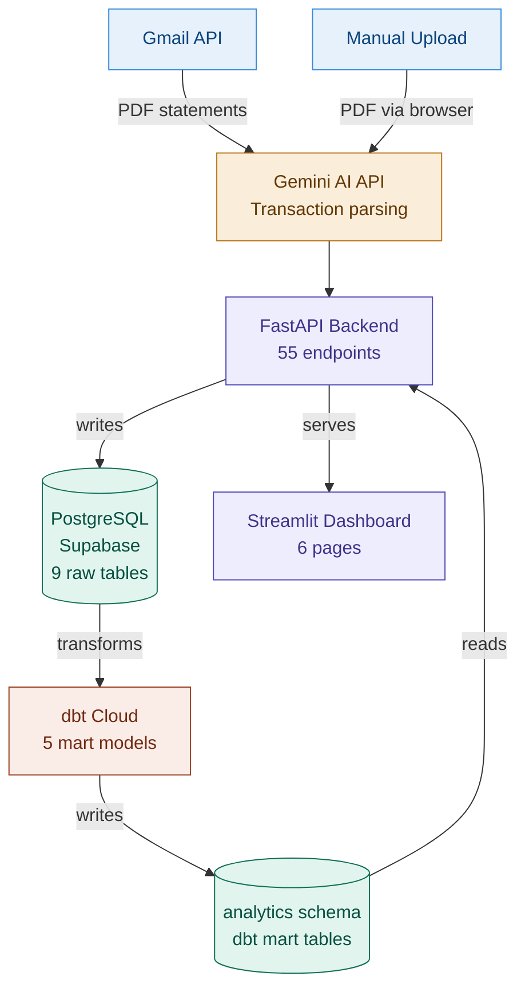
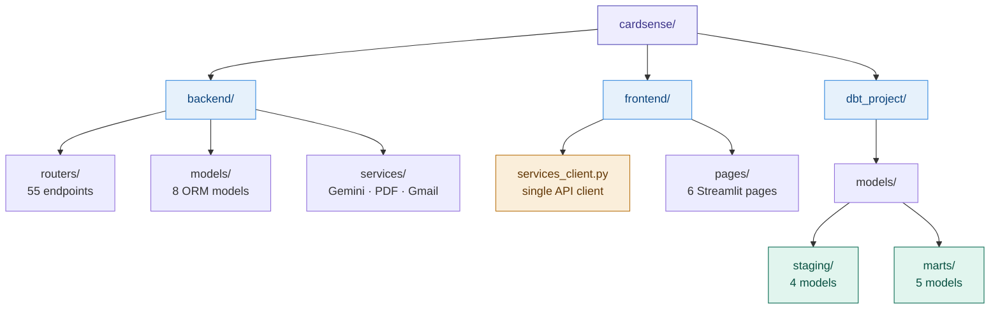

# CardSense - Personal Finance Analytics Platform

> An automated personal finance platform that extracts credit card statements from Gmail, parses transactions via Gemini AI, and surfaces insights through a Streamlit dashboard built on dbt mart tables and a FastAPI REST API.

---

## What It Does

CardSense replaces manual credit card tracking with an automated pipeline:

- **Automatic ingestion** - connects to Gmail via Gmail API, detects new statement emails, downloads PDF attachments
- **AI extraction** - sends PDFs to Gemini AI which extracts every transaction, categorises it, and identifies EMIs and subscriptions
- **Data transformation** - dbt models transform raw transactions into analytics-ready mart tables scheduled via dbt Cloud
- **Analytics dashboard** - 6-page Streamlit app with spend anomaly detection, interest risk alerts, shared credit pool utilisation, and a loan prepayment calculator

---

## Architecture

---

## Tech Stack

| Layer | Technology |
|---|---|
| Frontend | Streamlit, Plotly |
| Backend API | FastAPI, Uvicorn |
| AI / Extraction | Gemini AI API, Gmail API |
| Database | PostgreSQL on Supabase |
| Transformation | dbt Core (local) + dbt Cloud (production) |
| Deployment | Leapcell (backend), Streamlit Cloud (frontend) |

---

## Project Structure

---

## Database Schema

**Raw tables** (`public.*`) - written by FastAPI:

| Table | Description |
|---|---|
| `cards` | Credit card details, limits, shared pool assignments |
| `statements` | Monthly statements with due dates and payment status |
| `transactions` | Individual transactions with AI-assigned categories |
| `payments` | Payment records with statement reconciliation |
| `loans` | Loan details with EMI schedule |
| `loan_payments` | Individual EMI payment records |
| `shared_limit_groups` | Shared credit pool groups across multiple cards |

**Mart tables** (`analytics.*`) - written by dbt, read by FastAPI:

| Model | Description |
|---|---|
| `spend_trends` | Monthly spend per card with rolling 3M average and anomaly flag |
| `spend_by_category` | Category breakdown per card per month |
| `merchant_analysis` | Top merchants with recurring detection via `months_active` |
| `payment_reconciliation` | Statement reconciliation with `interest_risk` and `estimated_interest` |
| `monthly_card_summary` | Current statement status per card with utilisation % |

---

## Key Features

**Automated Data Pipeline**
- Gmail API monitors inbox for new statement emails
- PDF attachments extracted using `pdfplumber`
- Gemini AI parses unstructured PDF text into structured transactions
- Duplicate prevention via Gmail message ID

**dbt Transformation Layer**
- 5 mart models transform raw transactions into analytics-ready tables
- `is_anomaly` flag auto-detected using rolling 3-month average
- `interest_risk` and `estimated_interest` computed per statement
- `months_active` per merchant enables recurring subscription detection
- Scheduled via dbt Cloud - triggered on demand via Dashboard refresh button

**Analytics Dashboard**
- Spend anomaly detection - months flagged by dbt as unusually high
- Interest risk alerts - statements where only minimum due was paid
- Shared credit pool utilisation - 4 card groups tracked against combined limit
- Loan amortization schedule with prepayment impact calculator
- AI-generated financial observations powered by Gemini

**Production Architecture**
- 55 FastAPI endpoints - full CRUD plus analytics queries
- Three-tier separation: frontend → API → database
- dbt runs on dbt Cloud, completely separate from API server

## Author

**Sangam Kumar** - Data Analyst at Adani Cement

